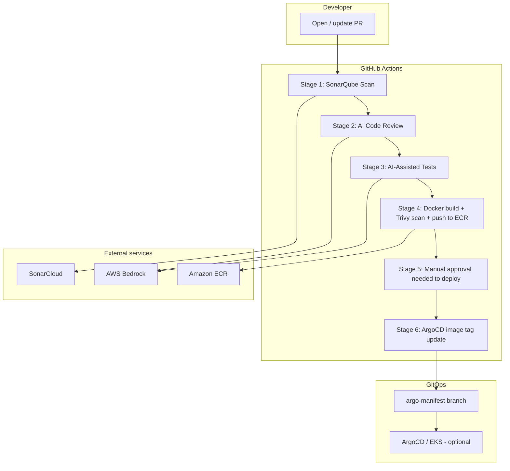
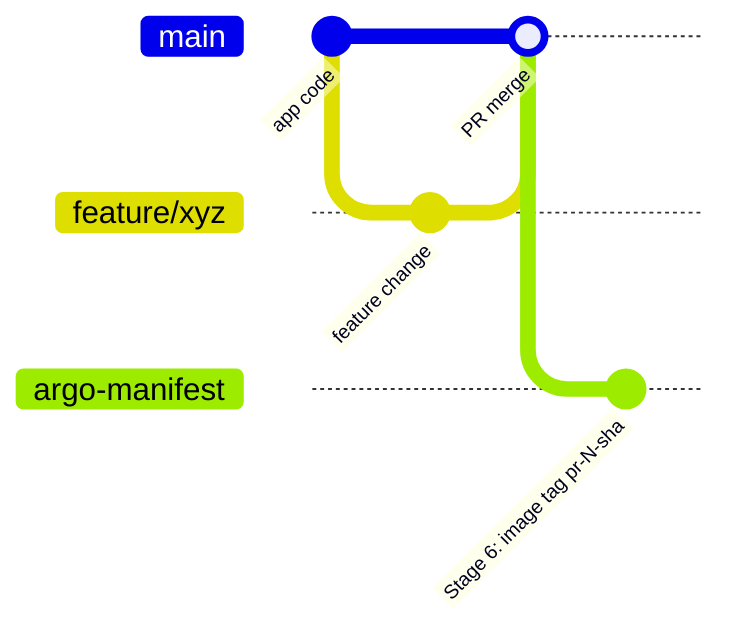
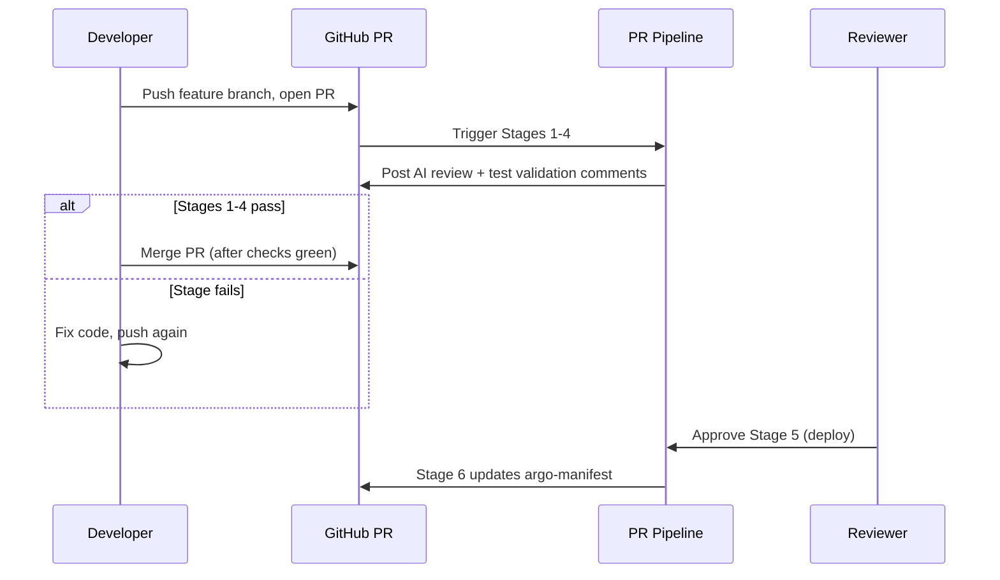

# Ponteo CI/CD Platform — Knowledge Transfer (KT) Guide

**Document type:** Knowledge Transfer / Handover  
**Audience:** Developers, DevOps engineers, platform owners  
**Repository:** `kushagra-g9/ponteo-project` (demo) → client production account  
**Last updated:** July 2026  

---

## Table of contents

1. [What you are setting up](#1-what-you-are-setting-up)
2. [Architecture at a glance](#2-architecture-at-a-glance)
3. [Prerequisites checklist](#3-prerequisites-checklist)
4. [Complete setup — step by step](#4-complete-setup--step-by-step)
5. [Pipeline stages — what each one does](#5-pipeline-stages--what-each-one-does)
6. [Branch and GitOps model](#6-branch-and-gitops-model)
7. [GitHub configuration reference](#7-github-configuration-reference)
8. [AWS configuration reference](#8-aws-configuration-reference)
9. [Day-to-day developer workflow](#9-day-to-day-developer-workflow)
10. [Deploy approval workflow (Stages 5 & 6)](#10-deploy-approval-workflow-stages-5--6)
11. [Troubleshooting guide](#11-troubleshooting-guide)
12. [Production migration checklist](#12-production-migration-checklist)
13. [Handover sign-off checklist](#13-handover-sign-off-checklist)

---

## 1. What you are setting up

Ponteo is a **6-stage Pull Request pipeline** that runs automatically when a developer opens or updates a PR. It validates code quality, runs AI-assisted review, tests the app, builds a container, scans it for vulnerabilities, and—after human approval—updates the Kubernetes manifest for ArgoCD-style GitOps.

### In plain English

| Step | What happens |
|------|----------------|
| Developer opens PR | Pipeline starts automatically |
| Stages 1–4 pass | Code is safe to **merge** into `main` |
| Stage 5 approved | Someone explicitly approves **deployment** |
| Stage 6 runs | New Docker image tag is written to `argo-manifest` branch |
| ArgoCD (optional) | Watches `argo-manifest` and rolls out the new image |

### Important distinction: Merge vs Deploy

| Action | Gated by |
|--------|----------|
| **Merge PR to `main`** | Stages 1–4 + SonarCloud (branch protection) |
| **Promote to deploy manifest** | Stage 5 (manual approval) + Stage 6 |

You can merge code without deploying, and you can deploy only after Stages 1–4 have passed on that PR.

---

## 2. Architecture at a glance



### Technology stack

| Layer | Technology |
|-------|------------|
| Application | Node.js 22, Express microservice |
| Container | Multi-stage Dockerfile, distroless runtime |
| CI/CD | GitHub Actions, composite actions |
| Quality | SonarCloud quality gate |
| AI review | AWS Bedrock (Claude Sonnet 4.5) |
| Security scan | Trivy (image vulnerabilities) |
| Registry | Amazon ECR |
| GitOps | `argo-manifest` branch (Kubernetes Deployment YAML) |

### Repository layout

| Path | Purpose |
|------|---------|
| `src/`, `test/` | Application source and Jest tests |
| `Dockerfile` | Production container build |
| `.github/workflows/pr-pipeline.yml` | Main 6-stage pipeline |
| `.github/actions/` | Reusable steps (Sonar, Bedrock, Docker+Trivy) |
| `scripts/` | Python helpers (AI review, Trivy gate, branch protection) |
| `prompts/` | Bedrock prompt templates |
| `docs/` | Documentation (this guide) |
| **`argo-manifest` branch** | Kubernetes manifests only — **not on `main`** |

---

## 3. Prerequisites checklist

Complete every item before running the pipeline.

### Accounts and tools

- [ ] GitHub account (repo admin access)
- [ ] AWS account with billing enabled
- [ ] AWS CLI installed and configured locally
- [ ] Node.js **22+** and npm installed locally
- [ ] Python **3.12+** (for local script testing, optional)
- [ ] SonarCloud account (free tier works for demo)

### AWS services to enable

- [ ] Amazon Bedrock — enable **Claude Sonnet 4.5** in `us-east-1`
- [ ] Amazon ECR — create repository
- [ ] IAM OIDC provider for GitHub Actions

### GitHub repo settings

- [ ] Repository created and code pushed to `main`
- [ ] GitHub **Variables** configured (see Section 7)
- [ ] GitHub **Secrets** configured (see Section 7)
- [ ] GitHub **Environments** `production` and `staging` with reviewers
- [ ] Branch protection on `main` (see Section 4, Step 10)
- [ ] `argo-manifest` orphan branch created (see Section 6)

### Demo note

On GitHub **Free** plans, **Environment protection rules** (Stage 5 manual approval) require a **public** repository or GitHub Team/Enterprise.

---

## 4. Complete setup — step by step

Follow these steps **in order** for a greenfield setup.

---

### Step 1 — Verify the application locally

```bash
cd Ponteo-project
npm ci
npm test
```

**Expected result:** All tests pass.

**API endpoints (after `npm start`):**

| Endpoint | Purpose |
|----------|---------|
| `GET /health` | Liveness probe |
| `GET /ready` | Readiness probe (includes version info) |
| `GET /version` | Build metadata (service, tag, git SHA) |
| `GET /sum?a=1&b=2` | Sample business endpoint |

---

### Step 2 — Create and push the GitHub repository

```bash
git init
git add .
git commit -m "chore: initial Ponteo Project CI/CD"
git branch -M main
git remote add origin https://github.com/YOUR_USER/ponteo-project.git
git push -u origin main
```

Replace `YOUR_USER` with your GitHub username or organization.

---

### Step 3 — Enable Amazon Bedrock

1. Open **AWS Console → Amazon Bedrock → Model access**
2. Enable **Anthropic Claude Sonnet 4.5** in region **`us-east-1`**
3. Complete the Anthropic use-case form (first-time only)
4. Test in the Bedrock playground

**Model ID used by the pipeline:**

```
us.anthropic.claude-sonnet-4-5-20250929-v1:0
```

---

### Step 4 — Configure AWS OIDC and IAM role

GitHub Actions authenticates to AWS **without long-lived keys** using OIDC.

#### 4a. Create OIDC identity provider

**IAM → Identity providers → Add provider**

| Field | Value |
|-------|-------|
| Provider type | OpenID Connect |
| Provider URL | `https://token.actions.githubusercontent.com` |
| Audience | `sts.amazonaws.com` |

#### 4b. Create IAM role (Web identity)

**IAM → Roles → Create role → Web identity**

- Identity provider: `token.actions.githubusercontent.com`
- Audience: `sts.amazonaws.com`

**Trust policy condition** — restrict to your repo (example):

```
repo:YOUR_USER/ponteo-project:ref:refs/heads/main
repo:YOUR_USER/ponteo-project:ref:refs/heads/staging
repo:YOUR_USER/ponteo-project:ref:refs/heads/develop
repo:YOUR_USER/ponteo-project:pull_request
```

Suggested role name: `github-actions-ponteo-project-ci`

#### 4c. Attach permissions

| Service | Permissions needed |
|---------|-------------------|
| **ECR** | `ecr:GetAuthorizationToken` on `*` |
| **ECR repo** | Push/pull on `arn:aws:ecr:REGION:ACCOUNT:repository/ponteo/ponteo-project` |
| **Bedrock** | `bedrock:InvokeModel` on Claude Sonnet 4.5 model + inference profile |

Copy the role ARN — you will add it as GitHub secret `AWS_ROLE_ARN`.

---

### Step 5 — Create ECR repository

```bash
aws ecr create-repository \
  --repository-name ponteo/ponteo-project \
  --region us-east-1
```

Note your registry URL:

```
ACCOUNT_ID.dkr.ecr.us-east-1.amazonaws.com
```

---

### Step 6 — Configure SonarCloud

1. Go to [https://sonarcloud.io](https://sonarcloud.io)
2. Import the `ponteo-project` repository
3. Record:
   - **Organization key** → `SONAR_ORGANIZATION`
   - **Project key** → `SONAR_PROJECT_KEY`
4. Generate a **user token** → `SONAR_TOKEN`

Quality gate is enforced in Stage 1 (`sonar.qualitygate.wait=true`).

---

### Step 7 — Add GitHub repository variables

**GitHub → Repository → Settings → Secrets and variables → Actions → Variables**

| Variable | Example value | Required |
|----------|---------------|----------|
| `AWS_REGION` | `us-east-1` | Yes |
| `ECR_REGISTRY` | `514201996443.dkr.ecr.us-east-1.amazonaws.com` | Yes |
| `ECR_REPOSITORY` | `ponteo/ponteo-project` | Yes |
| `SERVICE_NAME` | `ponteo-project` | Yes |
| `SONAR_PROJECT_KEY` | your SonarCloud project key | Yes |
| `SONAR_ORGANIZATION` | your SonarCloud org key | Yes |
| `BEDROCK_MODEL_ID` | `us.anthropic.claude-sonnet-4-5-20250929-v1:0` | Yes |
| `BEDROCK_COST_MODE` | `smart` | Recommended |
| `MANIFEST_BRANCH` | `argo-manifest` | Optional (default) |
| `GITOPS_MANIFEST_PATH` | `argo-manifest/deployment.yaml` | Optional (default) |
| `TRIVY_BLOCK_CLASS` | `lang-pkgs` | Optional (default) |

**Optional — external GitOps repo instead of in-repo manifest branch:**

| Variable | Value |
|----------|-------|
| `GITOPS_REPO` | `org/ponteo-gitops` |
| Secret `GITOPS_PAT` | PAT with write access to that repo |

---

### Step 8 — Add GitHub repository secrets

**Settings → Secrets and variables → Actions → Secrets**

| Secret | Value |
|--------|-------|
| `AWS_ROLE_ARN` | `arn:aws:iam::ACCOUNT:role/github-actions-ponteo-project-ci` |
| `SONAR_TOKEN` | SonarCloud token |
| `SONAR_HOST_URL` | `https://sonarcloud.io` |

`GITHUB_TOKEN` is provided automatically by GitHub Actions.

---

### Step 9 — Create GitHub Environments

**Settings → Environments**

Create two environments:

| Environment | Used when PR targets | Purpose |
|-------------|---------------------|---------|
| `production` | `main` | Stage 5 deploy approval |
| `staging` | `staging` / `develop` | Stage 5 deploy approval |

For each environment:

1. Add **Required reviewers** (yourself or team)
2. Optionally add deployment branch rules

Stage 5 pauses the workflow until a reviewer clicks **Review deployments → Approve**.

---

### Step 10 — Configure branch protection on `main`

Merge to `main` is blocked until required checks pass.

#### Option A — Script (recommended)

```bash
export GITHUB_TOKEN=ghp_your_admin_token
python3 scripts/setup_branch_protection.py
```

#### Option B — GitHub UI

**Settings → Branches → Add / edit rule for `main`**

| Setting | Value |
|---------|-------|
| Require a pull request before merging | ✅ Yes |
| Required approving reviews | `0` (solo) or `1+` (team) |
| Require status checks to pass before merging | ✅ Yes |
| Require branches to be up to date before merging | ✅ Yes |
| Include administrators | ✅ Yes (recommended for demo) |

**Required status checks — use these exact names:**

| Check name | Source |
|------------|--------|
| `Stage 1 - SonarQube Scan` | GitHub Actions |
| `Stage 2 - AI Code Review` | GitHub Actions |
| `Stage 3 - AI-Assisted Tests` | GitHub Actions |
| `Stage 4 - Docker build + Trivy scan + push to ECR` | GitHub Actions |
| `SonarCloud Code Analysis` | SonarCloud |

> **Do not** require Stage 5 or Stage 6 — those gate deployment, not merge.

> **Important:** If you rename pipeline job names in the workflow, update branch protection to match. A mismatch shows as an orange “Expected — Waiting for status” check even when the pipeline succeeded.

---

### Step 11 — Create the `argo-manifest` branch (one-time)

The `main` branch holds **application code only**. Kubernetes manifests live on a separate branch.

```bash
git checkout --orphan argo-manifest
git rm -rf . 2>/dev/null || true
mkdir -p argo-manifest

# Copy or create deployment.yaml and service.yaml under argo-manifest/
# (see existing argo-manifest branch for reference)

git add argo-manifest/
git commit -m "chore: initialize manifest-only branch"
git push -u origin argo-manifest
git checkout main
```

Stage 6 will update **only** the `image:` field in `argo-manifest/deployment.yaml`.

---

### Step 12 — Run your first end-to-end test

```bash
git checkout -b feature/first-pipeline-test
# Make a small change in src/ or test/
git add .
git commit -m "feat: trigger first pipeline run"
git push -u origin feature/first-pipeline-test
```

1. Open a PR to `main` on GitHub
2. Watch **Actions → PR Pipeline**
3. Confirm Stages 1–4 go green
4. Approve **Stage 5** in the `production` environment
5. Confirm **Stage 6** updates `argo-manifest`
6. Merge the PR when branch protection checks are green

**Success criteria:**

- [ ] All 6 stages completed
- [ ] AI Review and Test Validation comments posted on the PR
- [ ] Image visible in ECR: `aws ecr list-images --repository-name ponteo/ponteo-project`
- [ ] `argo-manifest/deployment.yaml` shows new image tag

---

## 5. Pipeline stages — what each one does

### Stage 1 — SonarQube Scan

| Item | Detail |
|------|--------|
| **Trigger** | Every PR (except docs-only paths) |
| **What it does** | Runs unit tests with coverage, uploads to SonarCloud, waits for quality gate |
| **Blocks merge?** | Yes |
| **Artifacts** | `sonar-report`, `coverage-report` |
| **Common failures** | Quality gate failed, low coverage, code smells |

---

### Stage 2 — AI Code Review

| Item | Detail |
|------|--------|
| **What it does** | Sends git diff to AWS Bedrock for security/quality review |
| **Blocks merge?** | Yes (blocking verdict) |
| **Output** | PR comment (`<!-- ponteo-ai-review-bot -->`) |
| **Cost control** | `BEDROCK_COST_MODE=smart` skips trivial/docs-only PRs |
| **Common failures** | Bedrock permissions, model not enabled, IAM role trust |

---

### Stage 3 — AI-Assisted Tests

| Item | Detail |
|------|--------|
| **What it does** | Runs `npm test`, then Bedrock validates test output vs code changes |
| **Hard gate** | **npm tests must pass** |
| **AI role** | Advisory when tests pass; blocking only on test failure or critical gaps |
| **Output** | PR comment (`<!-- ponteo-test-validation-bot -->`) |
| **Common failures** | Failing unit tests, Bedrock timeout |

---

### Stage 4 — Docker build + Trivy scan + push to ECR

| Item | Detail |
|------|--------|
| **Order** | 1. Build locally → 2. Trivy scan → 3. Push to ECR **only if scan passes** |
| **Blocks merge?** | Yes |
| **Image tag format** | `pr-{PR_NUMBER}-{12_CHAR_SHA}` |
| **Trivy policy** | Blocks on HIGH/CRITICAL in `lang-pkgs` by default (app dependencies) |
| **OS CVEs** | Informational only (distroless base) |
| **Artifacts** | `trivy-image-report` |
| **Common failures** | Docker build error, app CVE in npm deps, ECR permissions |

---

### Stage 5 — Manual approval needed to deploy

| Item | Detail |
|------|--------|
| **What it does** | Pauses workflow; waits for human approval in GitHub Environment |
| **Blocks merge?** | No |
| **Blocks deploy?** | Yes |
| **How to approve** | Actions run → Stage 5 → **Review deployments** → Approve `production` |

---

### Stage 6 — ArgoCD image tag update

| Item | Detail |
|------|--------|
| **What it does** | Checks out `argo-manifest` branch, updates `image:` in deployment YAML, commits and pushes |
| **Blocks merge?** | No |
| **Requires** | Stage 4 image URI + Stage 5 approval |
| **Commit author** | `github-actions[bot]` |
| **Common failures** | `argo-manifest` branch missing, `contents:write` permission, manifest path wrong |

---

## 6. Branch and GitOps model



| Branch | Contains | Updated by |
|--------|----------|------------|
| `main` | App source, tests, CI workflows | PR merge |
| `feature/*` | Developer work | Developer |
| `argo-manifest` | `argo-manifest/deployment.yaml`, `service.yaml` | Stage 6 only |

**Why separate branches?**

- Application releases and infrastructure promotion are decoupled
- ArgoCD watches `argo-manifest` without scanning application PRs
- Stage 6 never touches application code on `main`

---

## 7. GitHub configuration reference

### Bedrock cost modes (`BEDROCK_COST_MODE`)

| Mode | Stage 2 AI | Stage 3 AI |
|------|------------|------------|
| `smart` (default) | App/config changes only | On test failure; on pass for risky changes |
| `economy` | Same as smart | Only when tests fail |
| `full` | Always | Always |

Also skipped automatically: README-only, `.github/` only, `prompts/` only PRs.

### Pipeline triggers

- **On:** PR opened, synchronized, reopened, ready for review
- **Target branches:** `main`, `staging`, `develop`
- **Ignored paths:** `**.md`, `docs/**`, `.gitignore`, `LICENSE`

### Concurrency

One pipeline run per PR number; newer pushes cancel in-progress runs.

---

## 8. AWS configuration reference

### Demo account (reference)

| Setting | Value |
|---------|-------|
| AWS Account | `514201996443` |
| Region | `us-east-1` |
| ECR repo | `ponteo/ponteo-project` |
| IAM role | `github-actions-ponteo-project-ci` |

### Verify ECR images after Stage 4

```bash
aws ecr describe-images \
  --repository-name ponteo/ponteo-project \
  --region us-east-1 \
  --query 'sort_by(imageDetails,& imagePushedAt)[-3:].imageTags' \
  --output table
```

### Image build metadata (in container)

Set at Docker build time via CI:

| Env var | Source |
|---------|--------|
| `VERSION` | Image tag (e.g. `pr-13-abc123`) |
| `VCS_REF` | Git commit SHA |
| `BUILD_DATE` | Build timestamp |

Visible at `GET /version` inside the running container.

---

## 9. Day-to-day developer workflow



### Standard steps for a feature

1. `git checkout -b feature/my-change`
2. Write code + tests
3. `npm test` locally
4. Push and open PR to `main`
5. Fix anything flagged by SonarQube, AI review, or tests
6. Merge when required checks are green
7. Deploy reviewer approves Stage 5 when ready to promote image

---

## 10. Deploy approval workflow (Stages 5 & 6)

### How to approve Stage 5

1. Go to **Actions → PR Pipeline** (the run for your PR)
2. Click job **Stage 5 - Manual approval needed to deploy**
3. Click **Review deployments**
4. Select `production` → **Approve and deploy**

### What Stage 6 changes

Example commit on `argo-manifest`:

```
ci(pr-13): update image tag pr-13-854432686481

PR: kushagra-g9/ponteo-project#13
SHA: ...
Approved by: your-github-user
Updated: argo-manifest/deployment.yaml (image field only)
```

Only the `image:` line changes — replicas, probes, resources stay untouched.

---

## 11. Troubleshooting guide

### Merge blocked — orange “Expected” check

| Symptom | Cause | Fix |
|---------|-------|-----|
| `Stage 4 - Docker Build + ECR + Trivy` waiting forever | Old check name in branch protection | Remove old name; add `Stage 4 - Docker build + Trivy scan + push to ECR` |
| Check passed but still blocked | Name mismatch (case/spacing) | Match **exact** job name from Actions sidebar |

### Stage 2 — AI Code Review failed

| Symptom | Fix |
|---------|-----|
| `AccessDeniedException` on Bedrock | Enable model in Bedrock console; add `bedrock:InvokeModel` to IAM role |
| Exit code 141 | Usually git diff truncation — ensure latest workflow is on the branch |
| AI verdict FAIL | Read PR comment; fix issues or adjust code |

### Stage 3 — Tests or AI validation failed

| Symptom | Fix |
|---------|-----|
| npm test failed | Run `npm test` locally; fix failing tests |
| AI FAIL but tests passed | Check PR comment — advisory items may still be listed; pipeline should pass unless critical |

### Stage 4 — Trivy or ECR failed

| Symptom | Fix |
|---------|-----|
| Trivy gate failed | Download `trivy-image-report` artifact; update npm dependencies |
| OS CVEs only | Expected with distroless — blocked only on `lang-pkgs` by default |
| ECR push failed | Verify `ECR_REGISTRY`, `ECR_REPOSITORY`, IAM ECR permissions |

### Stage 5 — Cannot approve

| Symptom | Fix |
|---------|-----|
| No “Review deployments” button | Repo must be public (free tier) or use GitHub Team; environment must have reviewers |
| Stage 5 skipped | PR may not target `main`; check environment mapping |

### Stage 6 — Manifest update failed

| Symptom | Fix |
|---------|-----|
| Branch not found | Create `argo-manifest` branch (Step 11) |
| Permission denied on push | Stage 6 job needs `contents: write` |
| No change committed | Image tag already matches — expected on re-run |

### Node.js 20 deprecation warnings in Actions

Informational only — GitHub is migrating action runtimes to Node 24. Pipeline still works. Update action versions (e.g. `actions/checkout@v5`) when convenient.

---

## 12. Production migration checklist

When moving from personal demo to client production:

| Item | Demo | Production |
|------|------|------------|
| GitHub runner | `ubuntu-latest` | `[self-hosted, linux, x64]` (if required) |
| Repository | Personal account | Client org/repo |
| AWS account | Personal | Client AWS account |
| IAM OIDC `sub` | `kushagra-g9/ponteo-project` | Client org/repo paths |
| ECR path | `ponteo/ponteo-project` | Client naming standard |
| SonarCloud | Personal org | Client SonarCloud org |
| Environments | Solo reviewer | Team approval matrix |
| Branch protection | 0 reviews | 1+ required reviewers |
| ArgoCD | Optional / manual | Connected to EKS cluster |
| Secrets | GitHub secrets | Consider AWS Secrets Manager for client policies |

---

## 13. Handover sign-off checklist

Use this when transferring ownership to a new team member.

### Access verified

- [ ] GitHub repo admin access
- [ ] AWS Console access (IAM, ECR, Bedrock)
- [ ] SonarCloud project access
- [ ] GitHub Environment approver role

### Configuration verified

- [ ] All GitHub Variables set (Section 7)
- [ ] All GitHub Secrets set (Section 8)
- [ ] IAM OIDC role trust matches repo
- [ ] Branch protection checks match current job names
- [ ] `argo-manifest` branch exists with valid manifests

### Pipeline verified

- [ ] Test PR completed Stages 1–6 successfully
- [ ] ECR contains expected image tags
- [ ] `argo-manifest` image field updated after Stage 6
- [ ] AI PR comments appear on test PR

### Documentation

- [ ] This KT guide reviewed
- [ ] README.md quick reference understood
- [ ] On-call / approver contact documented by team

---

## Quick links

| Resource | URL |
|----------|-----|
| Repository | https://github.com/kushagra-g9/ponteo-project |
| Actions | https://github.com/kushagra-g9/ponteo-project/actions |
| Workflow file | `.github/workflows/pr-pipeline.yml` |
| Branch protection script | `scripts/setup_branch_protection.py` |
| SonarCloud | https://sonarcloud.io |

---

## Related documents

| Document | Location |
|----------|----------|
| Quick setup README | `/README.md` |
| AI code review prompt | `/prompts/code_review.md` |
| Test validation prompt | `/prompts/test_validation.md` |

---

*End of Knowledge Transfer Guide*
